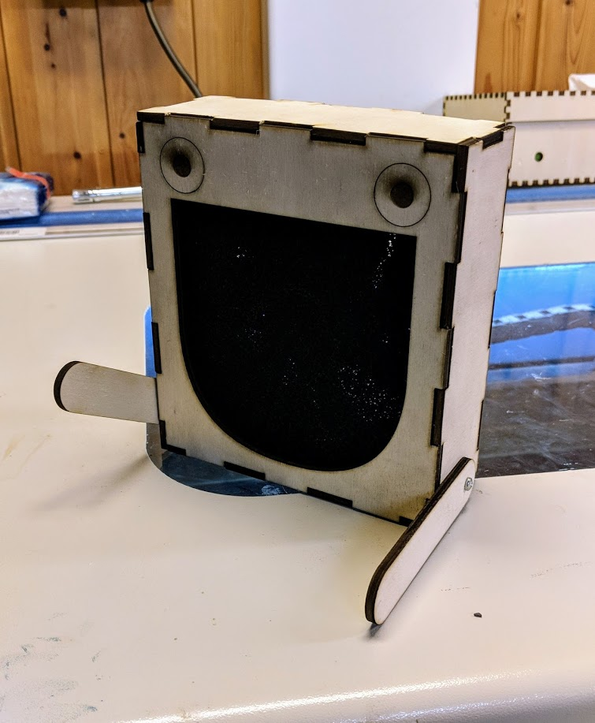
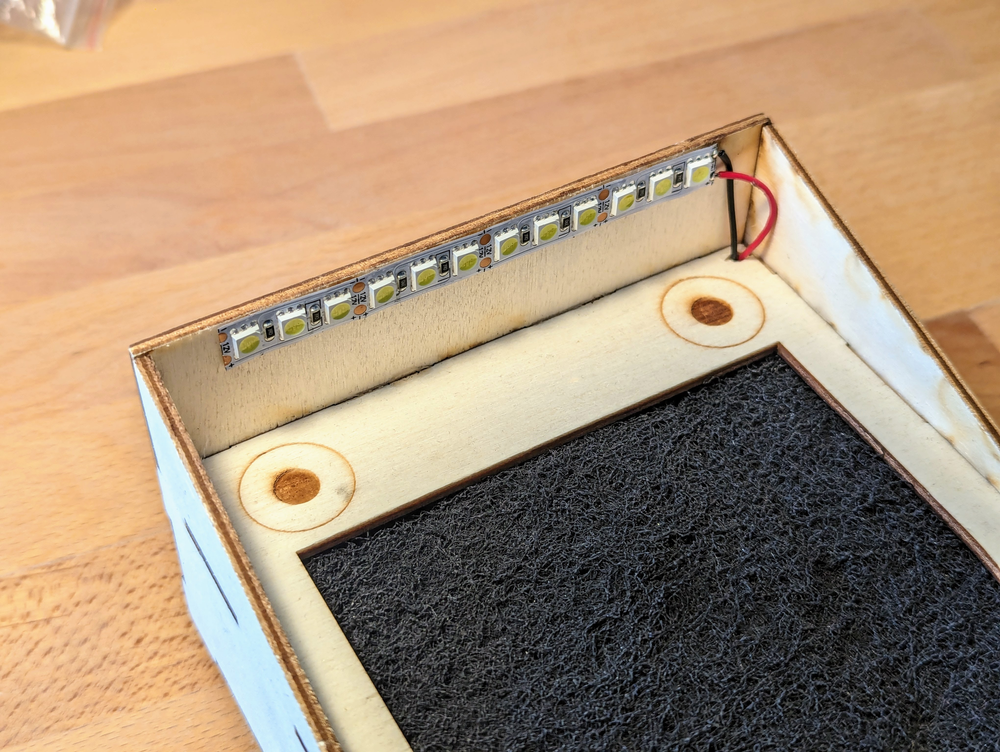
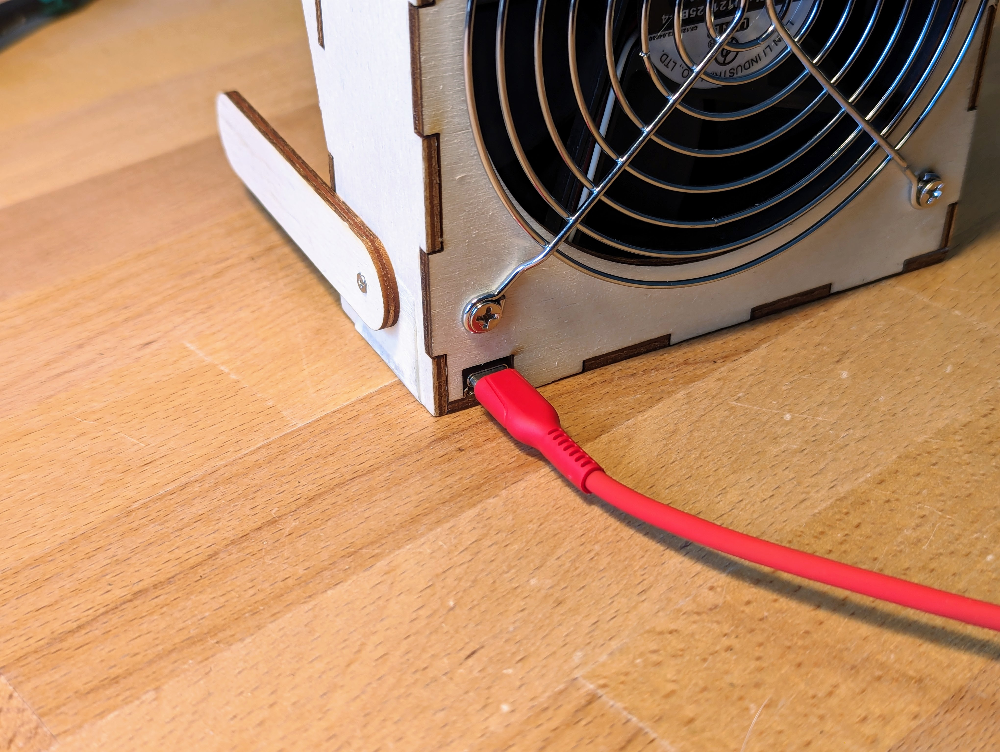

# "Humo" Solder Fume Extractor

This simple solder fume extractor just needs a PC fan and an solder fume filter. If you add some gogglie eyes the fume extractor has a pretty nice smiling face. It is optimised for laser cutted parts.

## Lasered Parts
The box for the lasered parts has been created with an kerf of 0,2mm. The different colours stand for:

- Red: Cut part
- Black: Scan part
- Green: Grave part

Please adjust your laser cutter.

## Neded Parts

### Version 1.1
This version uses a external 12V power supply.

|          Description          | Quantity |                    Description / Example                    |
|:-----------------------------:|:--------:|:-----------------------------------------------------------:|
| Laser cutted 3mm wooden parts | 1        | -                                                           |
| PC fan 120mm                  | 1        | Logilink FAN103 120x120x25mm (Pollin: 320377)               |
| Power supply 12V              | 1        | Stecker-Schaltnetzteil MV-12 (Pollin: 352213)               |
| Power supply socket           | 1        | Einbau-Hohlbuchse (Pollin: 450596)                          |
| Fan grill                     | 1        | Lüftergitter 120x120 mm (Pollin: 320660)                    |
| PC fan screw                  | 4        | Aliexpress "pc fan screw"                                   |
| Solderfume Filter             | 1        | Ersatzfilter Lötrauchabsaugung (Reichelt: FILTER ZD-153 EF) |
| Woodscrew          		| 2        | M2.2x8mm                                                    |

### Version 2.0
This version uses a DC-DC step up converter from 5V to 12V.

|     Description    | Quantity |                    Description / Example                    |
|:------------------:|:--------:|:-----------------------------------------------------------:|
| Laser cutted parts | 1        | 3mm wood                                                    |
| PC fan 120mm       | 1        | Logilink FAN103 120x120x25mm (Pollin: 320377)               |
| PC fan screws      | 4        | Aliexpress "pc fan screw"                                   |
| Fan grill          | 1        | Lüftergitter 120x120 mm (Pollin: 320660)                    |
| Solderfume Filter  | 1        | Ersatzfilter Lötrauchabsaugung (Reichelt: FILTER ZD-153 EF) |
| 5V to 12V step up  | 1        | MT3608 DC-DC                                                |
| Woodscrew          | 2        | M2.2x8mm                                                    |

### Version 2.2
This version has light, useses USBC to 12V adapter and a much better fan. It has now also a switch to turn it on and off.

|     Description    | Quantity |                    Description / Example                    |
|:------------------:|:--------:|:-----------------------------------------------------------:|
| Laser cutted parts | 1        | 3mm wood                                                    |
| PC fan 120mm       | 1        | SUNON MEC0251V3-000U-A99 (Reichelt: SUN MEC0251V3-0         |
| PC fan screws      | 4        | Aliexpress "pc fan screw"                                   |
| Fan grill          | 1        | Fan grill    120x120 mm (Pollin: 320660)                    |
| Solderfume Filter  | 1        | Replacement filter (Reichelt: FILTER ZD-153 EF)             |
| 5V to 12V step up  | 1        | PDC004-PD USBC trigger board                                |
| Woodscrew          | 2        | M2.2x8mm                                                    |
| LED stripe         | 10cm     | 12V warm white LED stripe                                   |
| Wire               | 15cm     | Some flexible wire any colour/size                          |

### Version 2.3
This version removes the need for the fan grill, as it's integrated in the design.
(otherwise the same as the version above)

|     Description    | Quantity |                    Description / Example                    |
|:------------------:|:--------:|:-----------------------------------------------------------:|
| Laser cutted parts | 1        | 3mm wood                                                    |
| PC fan 120mm       | 1        | SUNON MEC0251V3-000U-A99 (Reichelt: SUN MEC0251V3-0         |
| PC fan screws      | 4        | Aliexpress "pc fan screw"                                   |
| Solderfume Filter  | 1        | Replacement filter (Reichelt: FILTER ZD-153 EF)             |
| 5V to 12V step up  | 1        | PDC004-PD USBC trigger board                                |
| Woodscrew          | 2        | M2.2x8mm                                                    |
| LED stripe         | 10cm     | 12V warm white LED stripe                                   |
| Wire               | 15cm     | Some flexible wire any colour/size                          |

## Buy Parts online
You can also buy a kit with all needes parts (always the newest version) at blinkyparts:

[Humo - Soldering Kit](https://shop.blinkyparts.com/de/Humo-Dein-ganz-persoenlicher-Loetrauchabsauger/blipa231042)

## What does "Humo" stand for?
The hardest part for every project: The Name. Humo is spain for "fume". Props to zaesa for this hint :).

## Copyright and Authorship
Humo is licenced under [CC-BY-SA 4.0](https://creativecommons.org/licenses/by-sa/4.0/) - [Timo Schindler](https://www.timoschindler.de).
